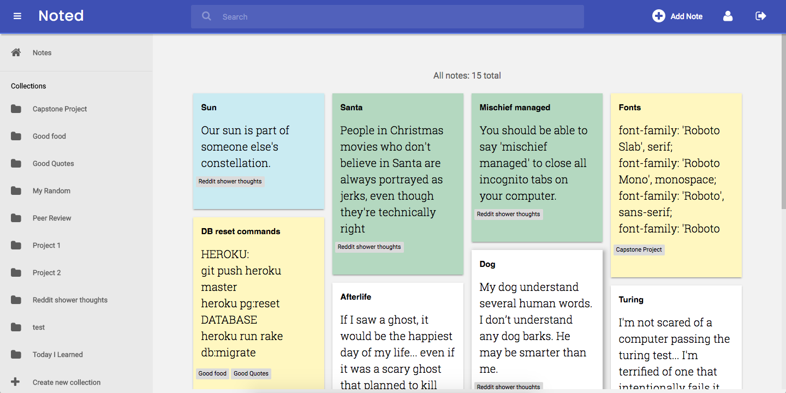
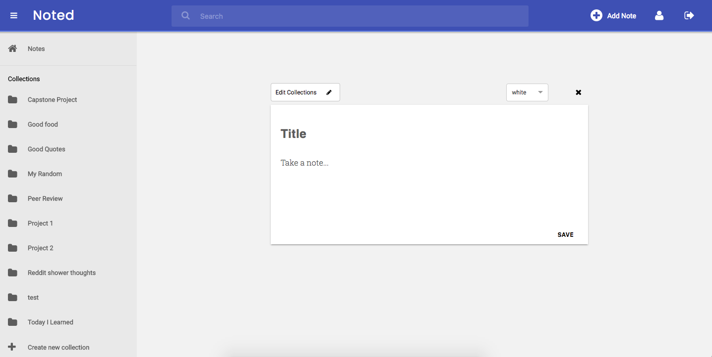
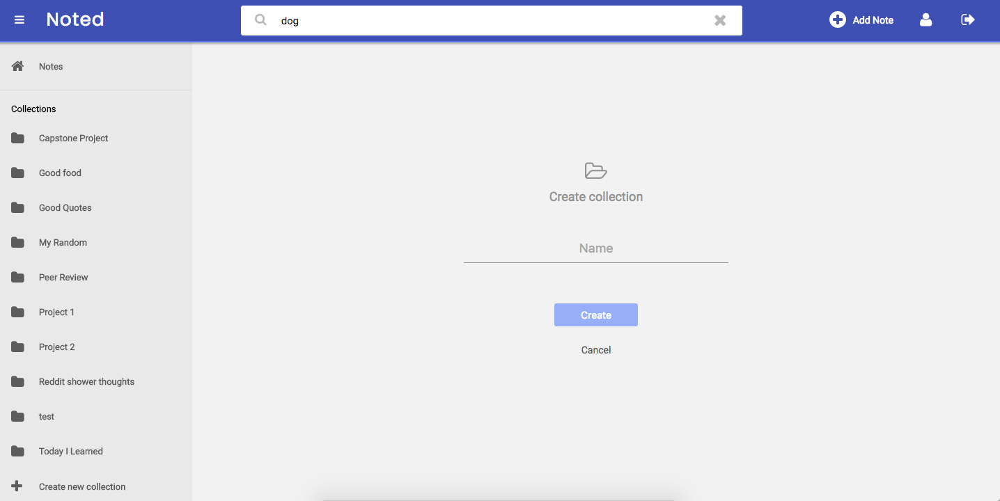
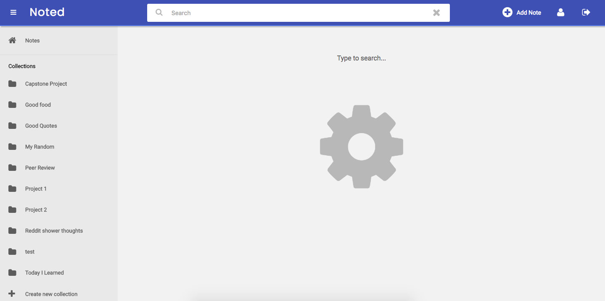
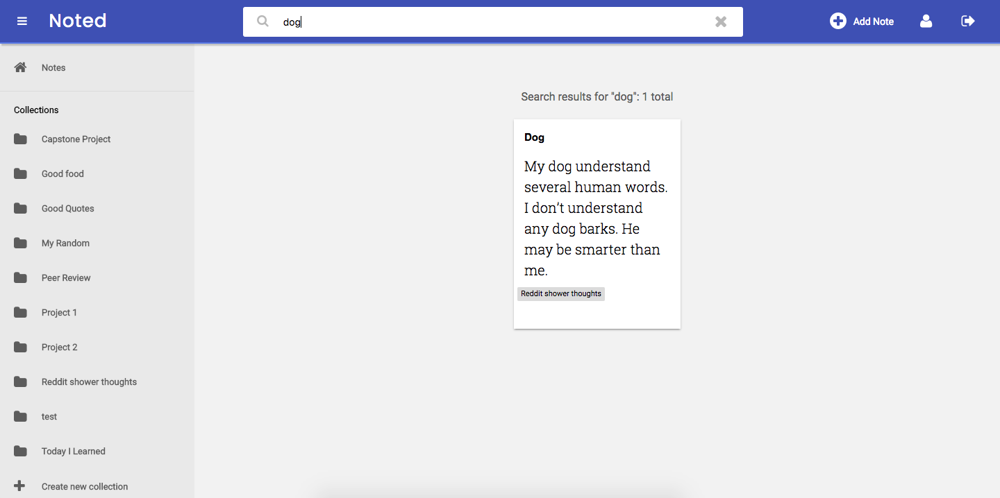

# Noted

[Noted live][heroku]

[heroku]: http://www.wellnoted.herokuapp.com

Noted is a full-stack web application inspired by Google Keep.  It utilizes Ruby on Rails on the backend, a PostgreSQL database, and React.js with a Redux architectural framework on the frontend.  

## Features & Implementation

### Single-Page App

Noted is a single-page; the entire site delivers dynamic components via one static page through the react/redux framework.  Noted utilizes authentication on the backend using a SessionController and authentication on the frontend using a SessionStore to allow account creation and user login/logout.

### Note Rendering and Editing

Users can create, view, and store notes. On the home page of this app, notes are shown in a tile view using the React Masonry library. This tile view utilizes a NoteIndex component and NoteIndexItem components to render the list of notes. Each NoteIndexItem shows the first few lines of the note only. By hovering over each individual note, users can see a trash icon that allows them to delete that note.

Users can navigate to a note by clicking on one in the tile view. This will take them to the NoteForm component where they can edit their existing note. The NoteForm component is also used to render the 'Add a note' functionality. Upon creating, updating, or deleting their note, users will be redirected to the home page.

Two other features in note editing include:
1. Note color - Users can edit and save note colors that will appear in the tile and indiviudal note views
2. Expandable text box - The NoteForm component starts out with a small text box to write in that expands as needed. The text box will remember its size upon saving the note.

### Collections

Collections act as folders for note organization / note tagging. Users can add notes to multiple collections. On the backend, this is implemented through a joins table for Collection Taggings, allowing for a many to many association across Notes and Collections.

Collections are found in a collapsable sidebar component to the left of the page. This list is rendered via a CollectionIndex component and CollectionIndexItem components. When hovering over each individual Collection in the list, users can expose options to edit or delete the note.

Editing and creating Collections are implemented with a CollectionForm component.

### Search

Noted has a simple regex search that will find matches in the note title, body, and collection. There is SearchBar component in the header bar that toggles via an active and inactive state depending on whether the user is currently on the search route. Navigating to any other route will render the SearchBar inactive.

As a user types, search results will appear on the page along with a count of the number of results found.

## Future Directions for the Project

### Autosaving

Currently, notes only save upon clicking the save button. I would like to implement an autosave feature that will allow for a smoother user experience.

### Better Search and Search Ranking

I plan on implementing better search functionality by using a fuzzy search javascript library and creating a lightweight search ranking.

### IBM Watson API

I'd like to use the IBM Watson API for AI categorization of notes via their natural language classifiers.

### Other

Other features I want to add include:
- More options to change notes collections / color directly in the note tile view
- Images for notes
- Collection search
